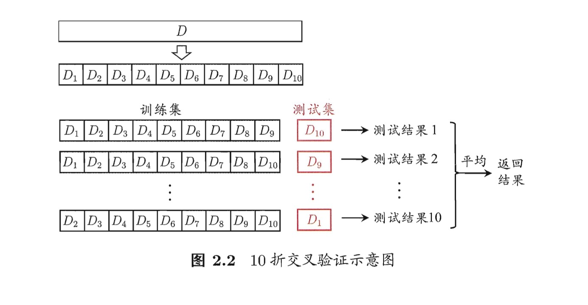
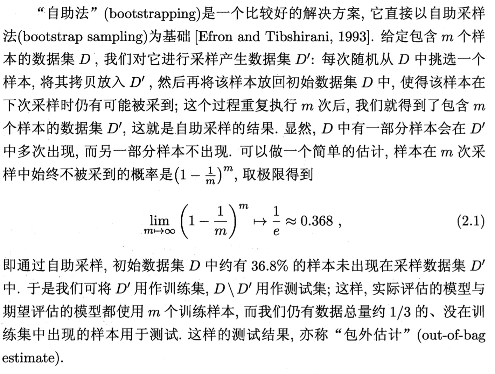

# 2.2 模型评估方法

## 1.留出法

将初始数据集 $D$ 划分为两个互斥的集合$D_{train}$和$D_{test}$,满足
$$
    D_{train} \cap D_{test} = \emptyset \\
    D_{train} \cup D_{test} = D
$$

注意:
- 训练集与测试集尽量保持数据分布的一致性 $\to$ 分层采样
- 多次划分方式取平均情况（避免划分方式的随机性）
- 训练集 : 测试集 (2/3 ~ 4/5)

### 1.1 加载数据集


```python
import numpy as np
import pandas as pd

df = pd.read_csv('../../Datasets/iris.data', header = None)
# show the first 5 items
df.head()
# show the last 5 items
df.tail()
```


<div>
<table border="1" class="dataframe">
  <thead>
    <tr style="text-align: right;">
      <th></th>
      <th>0</th>
      <th>1</th>
      <th>2</th>
      <th>3</th>
      <th>4</th>
    </tr>
  </thead>
  <tbody>
    <tr>
      <th>145</th>
      <td>6.7</td>
      <td>3.0</td>
      <td>5.2</td>
      <td>2.3</td>
      <td>Iris-virginica</td>
    </tr>
    <tr>
      <th>146</th>
      <td>6.3</td>
      <td>2.5</td>
      <td>5.0</td>
      <td>1.9</td>
      <td>Iris-virginica</td>
    </tr>
    <tr>
      <th>147</th>
      <td>6.5</td>
      <td>3.0</td>
      <td>5.2</td>
      <td>2.0</td>
      <td>Iris-virginica</td>
    </tr>
    <tr>
      <th>148</th>
      <td>6.2</td>
      <td>3.4</td>
      <td>5.4</td>
      <td>2.3</td>
      <td>Iris-virginica</td>
    </tr>
    <tr>
      <th>149</th>
      <td>5.9</td>
      <td>3.0</td>
      <td>5.1</td>
      <td>1.8</td>
      <td>Iris-virginica</td>
    </tr>
  </tbody>
</table>
</div>


```python
# get the data
y = df.iloc[:, 4].values
print("dataset has {} items, unique types: {}".format(len(y), np.unique(y)))
```

    dataset has 150 items, unique types: ['Iris-setosa' 'Iris-versicolor' 'Iris-virginica']


```python
# we need to transform the y from characters to some specific label
# perform preprocessing
from sklearn.preprocessing import LabelEncoder

labelEncoder = LabelEncoder()
y = labelEncoder.fit_transform(y)
```


```python
# we select 2 features, so that we can observe clearly
X = df.iloc[:, [2, 3]].values
X.shape
```


    (150, 2)


### 1.2 划分训练集，测试集(使用留出法)
取10次的平均情况


```python
from sklearn.model_selection import train_test_split
# StandardScaler perform standardrization
from sklearn.preprocessing import StandardScaler
from sklearn.linear_model import LogisticRegression

N = 10
scores = 0.0

for i in range(N):
    X_train, X_test, y_train, y_test = train_test_split(X, y, test_size = 0.3, stratify = y)
    
    sc = StandardScaler()
    sc.fit(X_train)
    X_train = sc.transform(X_train)
    X_test = sc.transform(X_test)

    lr = LogisticRegression(solver='lbfgs', multi_class='auto')
    lr.fit(X_train, y_train)
    score = lr.score(X_test, y_test)
    
    scores = scores + score
    print("iter {} : Accuracy : {}".format(i + 1, score))

print("Average Accuracy: {}".format(scores/N))
    
```

    iter 1 : Accuracy : 0.9555555555555556
    iter 2 : Accuracy : 0.9555555555555556
    iter 3 : Accuracy : 1.0
    iter 4 : Accuracy : 0.9555555555555556
    iter 5 : Accuracy : 0.9555555555555556
    iter 6 : Accuracy : 0.9555555555555556
    iter 7 : Accuracy : 1.0
    iter 8 : Accuracy : 0.9777777777777777
    iter 9 : Accuracy : 0.9777777777777777
    iter 10 : Accuracy : 0.9555555555555556
    Average Accuracy: 0.968888888888889


## 2. 使用交叉验证法(Cross Validation)

将初始数据集 $D$ 划分为$k$个互斥的集合$ D_1, D_2, \cdots, D_k $,满足
$$
    \forall \; i \neq j, D_i \cap D_j = \emptyset \\
    D_1 \cup D_2 \cup \cdots \cup D_k = D
$$

据此规则，有$k$种划分方式，取这$k$次测试结果的平均值.




## 2.1 交叉验证实现


```python
from sklearn.model_selection import StratifiedKFold

kfold = StratifiedKFold(n_splits = 10, random_state = 1).split(X, y)
scores = []
lr = LogisticRegression(solver='lbfgs', multi_class='auto', C = 100.0, random_state = 1)

for k, (train, test) in enumerate(kfold):
    # X_train, X_test, y_train, y_test = X[train], X[test], y[train], y[test]
    lr.fit(X[train], y[train])
    score = lr.score(X[test], y[test])
    scores.append(score)
    print('Fold {}: Accuracy: {}'.format(k + 1, score))

print('CV accuracy: {} +/- {}'.format(np.mean(scores), np.std(scores)))
```

    Fold 1: Accuracy: 1.0
    Fold 2: Accuracy: 0.9333333333333333
    Fold 3: Accuracy: 1.0
    Fold 4: Accuracy: 0.9333333333333333
    Fold 5: Accuracy: 0.9333333333333333
    Fold 6: Accuracy: 0.9333333333333333
    Fold 7: Accuracy: 0.8666666666666667
    Fold 8: Accuracy: 1.0
    Fold 9: Accuracy: 1.0
    Fold 10: Accuracy: 1.0
    CV accuracy: 0.96 +/- 0.044221663871405324


## 3.自助法

有放回的抽样策略[代码实现](BootStrap.py)




```python
import random

class BootStrap:
    def __init__(self):
        pass
    
    def generate_index(self, num):
        slice = []
        while(len(slice) < num):
            p = random.randrange(0, num)
            slice.append(p)
        return slice
    
    def train_test_split(self, X, y):
        assert len(X) == len(y)
        
        samples_num = len(X)
        
        all_index = set(range(samples_num))
        train_index = self.generate_index(samples_num)
        test_index = list(all_index - set(train_index))
        
        X_train = []
        X_test = []
        y_train = []
        y_test = []
        
        for i in train_index:
            X_train.append(X[i])
            y_train.append(y[i])
            
        for j in test_index:
            X_test.append(X[j])
            y_test.append(y[j])
        
        return X_train, X_test, y_train, y_test

    
N = 10
lr = LogisticRegression(solver = 'lbfgs', multi_class = 'auto', C = 100.0, random_state = 1)
bootstrap = BootStrap()

scores = []
for i in range(N):
    X_train, X_test, y_train, y_test = bootstrap.train_test_split(X, y)
    lr.fit(X_train, y_train)
    score = lr.score(X_test, y_test)
    
    print('iter {} - Accuracy: {}'.format(i + 1, score))
    scores.append(score)
    
print('BootStrap: Accuracy: {} +/- {}'.format(np.mean(scores), np.std(scores)))

    
```

    iter 1 - Accuracy: 0.9622641509433962
    iter 2 - Accuracy: 0.9615384615384616
    iter 3 - Accuracy: 0.9464285714285714
    iter 4 - Accuracy: 0.9310344827586207
    iter 5 - Accuracy: 0.9622641509433962
    iter 6 - Accuracy: 0.9777777777777777
    iter 7 - Accuracy: 1.0
    iter 8 - Accuracy: 0.9629629629629629
    iter 9 - Accuracy: 0.9814814814814815
    iter 10 - Accuracy: 0.9591836734693877
    BootStrap: Accuracy: 0.9644935713304056 +/- 0.01794667551467303


```python

```
