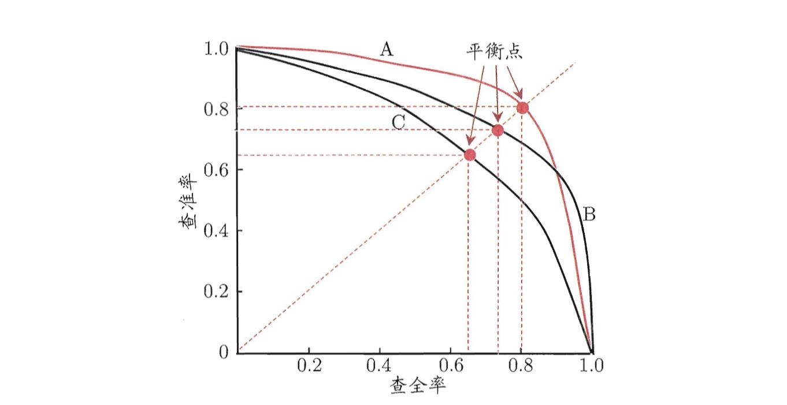
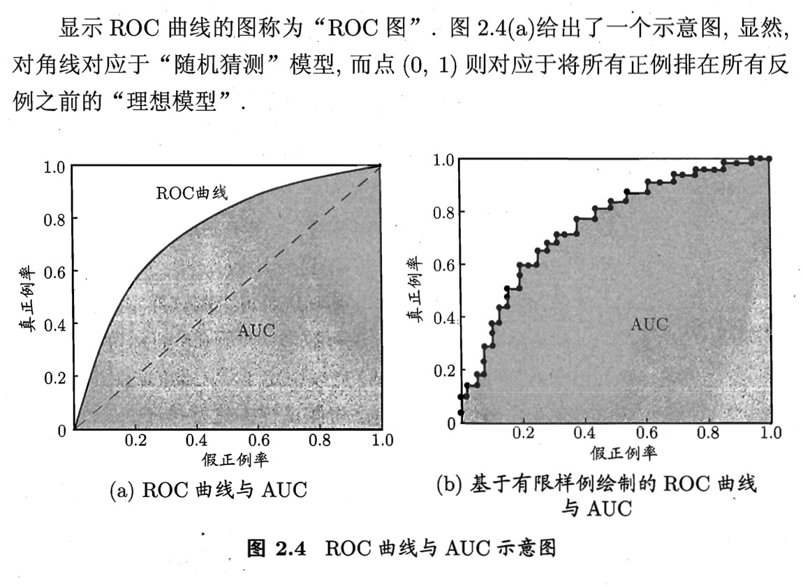

# 2.3 性能度量
性能度量： 衡量模型泛化能力的度量标准

预测任务中，给定样例集 $D = \{(x_1, y_1), (x_2, y_2), \cdots , (x_m, y_m) \}$, $y_i$ 是 $x_i$ 的标签。
给定学习模型$f$, 衡量学习模型$f$的性能, 即比较$f$与$y$.

回归任务常用误差度量: 均方差 (Mean Squared Error)
$$
E(f ; D)=\frac{1}{m} \sum_{i=1}^{m}\left(f\left(\boldsymbol{x}_{i}\right)-y_{i}\right)^{2}
$$

对于数据分布$\mathcal{D}$和概率密度函数$p(\cdot)$:
$$
E(f ; \mathcal{D})=\int_{\boldsymbol{x} \sim \mathcal{D}}(f(\boldsymbol{x})-y)^{2} p(\boldsymbol{x}) \mathrm{d} \boldsymbol{x}
$$


## 1 错误率与精度
错误率:
$$
E(f ; D) = \frac{1}{m} \sum_{i=1}^{m}\mathbb{I}\left(f(\boldsymbol{x_i}) \neq y_i \right)
$$
精度:
$$
\begin{aligned} \operatorname{Acc}(f ; D) &=\frac{1}{m} \sum_{i=1}^{m} \mathbb{I}\left(f\left(\boldsymbol{x}_{i}\right)=y_{i}\right) \\ &=1-E(f ; D) \end{aligned}
$$


## 2 混淆矩阵


|真实\预测| 正例 | 反例 |
|--------|-----|-----|
|正例| TP | FN |
|反例 |FP | TN |

## 3  $Precision, Recall, F_1, F_{\beta}$
根据混淆矩阵定义了:

### 3.1 查准率:
$$
Precision = \frac{TP}{TP + FP}
$$

### 3.2 查全率:
$$
Recall = \frac{TP}{TP + FN}
$$

PR图: 

分析：
P-R图中曲线$B$包住了曲线$C$，因此对应的模型$B$优于$C$.

$Precision$ 和$Recall$度量仍有偏好的区分，在某些情况下: 

若预测所有样例均为正例，则

$$
Recall = 100 \% \\
Precison = \frac{真实正例样本数量}{样本总量}
$$


### 3.3 $F_1$ Score:
$$
F_1 = 2 \frac{Precision \cdot Recall}{ Precision + Recall}
$$

### 3.4 $F_{\beta}$ Score:
$$
F_{\beta} = \left(1 + \beta^2 \right) \frac{Precision \cdot Recall}{ \beta^2 \cdot Precison + Recall } \\
\lim \limits_{\beta \to \infty} F_{\beta} \to Recall \\
\lim \limits_{\beta \to 0} F_{\beta} \to Precision
$$

## 4 ROC 与 AUC

### 4.1 ROC: Receiver Operating Characteristic
ROC曲线: 以假正率为$ \boldsymbol{x} $轴，以真正率为$ \boldsymbol{y} $轴的曲线.

假正率($FPR$):
$$
    FPR = \frac{FP}{FP + TN}
$$

真正率($TPR$):
$$
    TPR = \frac{TP}{TP + FN}
$$

### 4.2 AUC: Area Under ROC Curve 代表 ROC曲线下方的面积.

下面给出ROC与AUC的示意图:



```python

```
